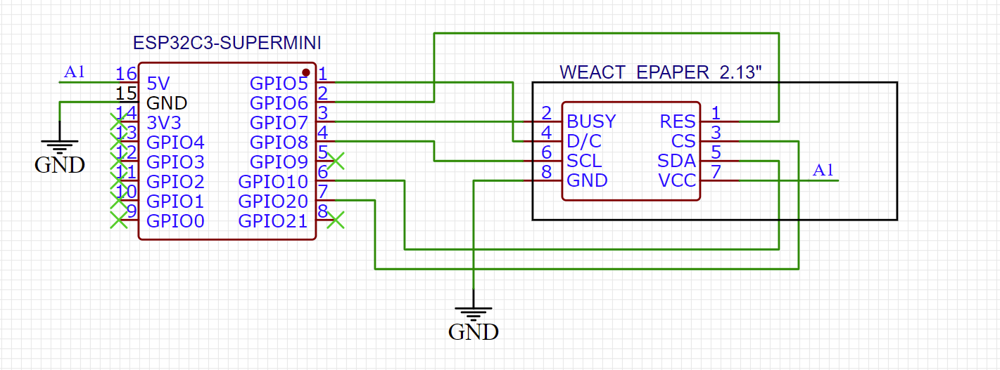
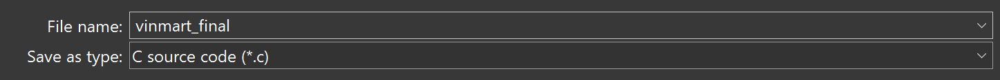

# ESP32 Web-Controlled e-Paper Display

Dự án này sử dụng ESP32 để tạo một web server cho phép người dùng nhập dữ liệu (tên và giá), sau đó hiển thị dữ liệu đó lên màn hình e-paper 3 màu (Đen, Trắng, Đỏ).
## Ứng dụng: Bảng giá siêu tiết kiệm năng lượng
E-paper chỉ cần kết nối esp32 khi cần thay đổi nội dung, không cần cấp năng lượng duy trì.

Ảnh:
Video:

## 🚀 Tính năng

- ESP32 hoạt động như một **Access Point** hoặc **kết nối WiFi**.
- Giao diện web đơn giản cho phép nhập dữ liệu tên và giá.
- Hiển thị dữ liệu lên màn hình e-paper 250x122 hỗ trợ 3 màu.
- Có thể cập nhật từng phần của màn hình (partial update).
- Hỗ trợ font chữ tùy chỉnh, Unicode tiếng Việt (nếu cần).

## 🛠 Phần cứng sử dụng

- ESP32 DevKit (hoặc tương đương)
- Màn hình e-Paper 250x122 3-color (Đen-Trắng-Đỏ)
- Nguồn 3.3V ổn định

## 🧑‍💻 Cài đặt

### 1. Thư viện Arduino cần có:
- `GxEPD` hoặc `GxEPD2`
- `Adafruit GFX`
- `WebServer`
- `WiFi`

### 2. Clone dự án

```bash
git clone git clone https://nthlam/Price_List_ePaper_2.13---WeAct.git
```
### 3. Lắp mạch ep32 <-> epaper


### 4. Cấu hình wifi 
const char* ssid = "ESP32-Access-Point";
const char* password = "12345678";

### 5. Cài đặt template
5.1: Scale ảnh
Dùng tool sau để scale về tỉ lệ 250x122 vẫn giữ nguyên tất cả thông tin trên ảnh:
https://www.irfanview.com/
- image/resize:
  .png)
- chỉnh width hoặc height (cạnh còn lại tính auto)
  
5.2: chuyển ảnh sang bitmap
Dùng tool: tải lcd-image-converter.zip
-> giải nén -> mở file .exe
-> open ảnh
  - -> images/resize để crop ảnh
  - file/convert chọn save as: *.c để lưu bitmap
    
  -> lấy phần bit map có cấu trúc như bên dưới paste vào code
static const uint8_t image_data_vinmart[3050]  = {}
*note:  display.drawBitmap(10, 0, image_data_vinmart, 200, 122, GxEPD_RED);
=> GxEDP_RED nghĩa là những bit 1 trong bitmap sẽ có màu đỏ
vị trí con trỏ bắt đầu in: (10,0)
kích cỡ ảnh sẽ in: (200,122)

### 6. Chỉnh sửa tùy chọn:

void capnhat(String text, int x, int y, int ngang, int doc){
  display.setPartialWindow(x, y, ngang, doc);
  display.firstPage();
  do {
    display.setFont(&FreeMonoBold9pt7b);
    display.setTextColor(GxEPD_BLACK);
    display.setCursor(x, y +  doc/2 + 5 );
    display.print(text);
  } while (display.nextPage());
}

*note:
// chỉ cập nhật 1 phần màn hình:
display.setPartialWindow(x, y, ngang, doc);
// cài màu chữ sẽ in
display.setTextColor(GxEPD_BLACK);
// đặt vị trí con trỏ bắt đầu in chữ (y + doc/2 +5 để con trỏ căn chữ giữa dòng)
display.setCursor(x, y +  doc/2 + 5 );
// in chữ lên màn (tạm thời lưu ở buffer)
display.print(text);
// cập nhật màn hình theo từng page (tránh tràn bộ nhớ)
display.firstPage();
  do {
    /*set up phần text*/
  } while (display.nextPage());


